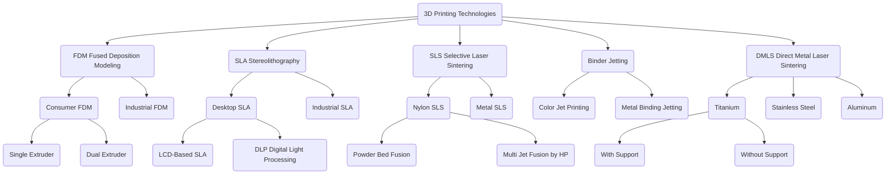

```mermaid
graph TD
    A(3D Printing Technologies) --> B(FDM Fused Deposition Modeling)
    A --> C(SLA Stereolithography)
    A --> D(SLS Selective Laser Sintering)
    A --> E(Binder Jetting)
    A --> F(DMLS Direct Metal Laser Sintering)

    B --> B1(Consumer FDM)
    B --> B2(Industrial FDM)

    C --> C1(Desktop SLA)
    C --> C2(Industrial SLA)

    D --> D1(Nylon SLS)
    D --> D2(Metal SLS)

    E --> E1(Color Jet Printing)
    E --> E2(Metal Binding Jetting)

    F --> F1(Titanium)
    F --> F2(Stainless Steel)
    F --> F3(Aluminum)

    B1 --> B1a(Single Extruder)
    B1 --> B1b(Dual Extruder)

    C1 --> C1a(LCD-Based SLA)
    C1 --> C1b(DLP Digital Light Processing)

    D1 --> D1a(Powder Bed Fusion)
    D1 --> D1b(Multi Jet Fusion by HP)

    F1 --> F1a(With Support)
    F1 --> F1b(Without Support)

```
