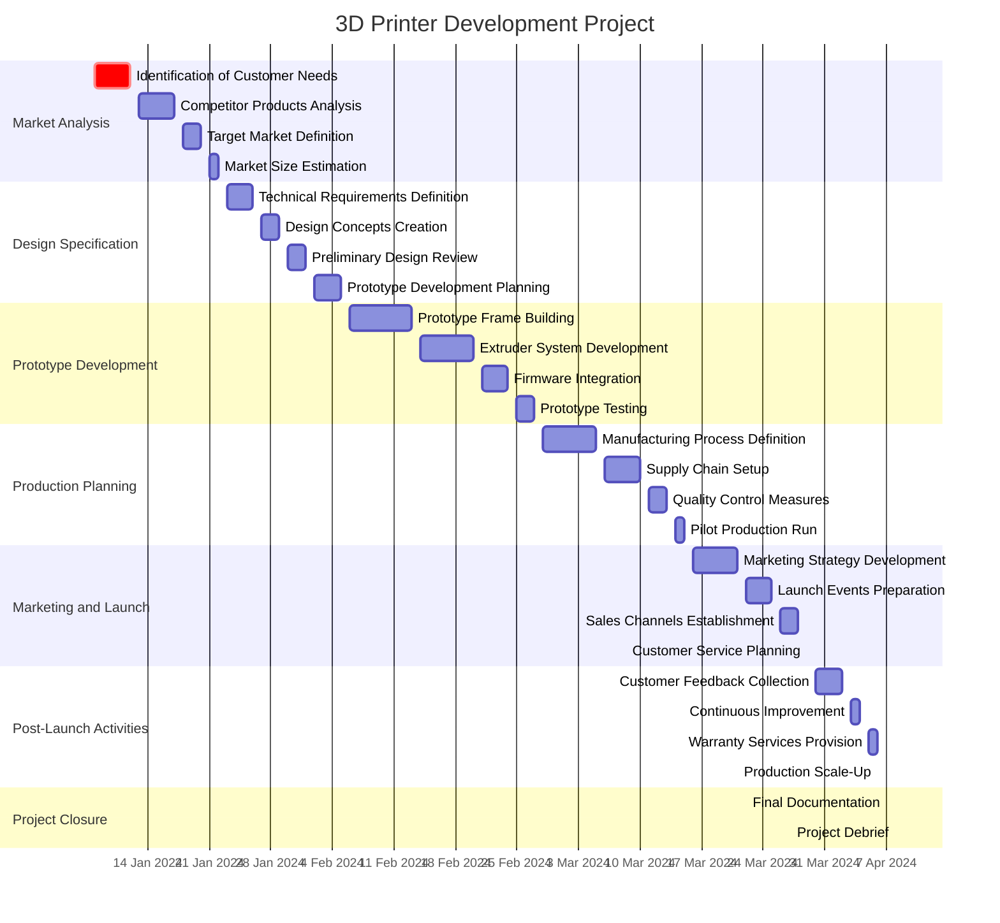

Creating a Mermaid Gantt chart for the 3D Printer Development Project involves specifying the tasks, their respective durations, and dependencies. Here's how you can structure it based on the given project timeline from January 8, 2024, to April 8, 2024:
To remove the vertical white bars that represent weekends in the Mermaid Gantt chart, you can adjust the `excludes` directive in the chart configuration. If you want the chart to include weekends without the white bars, you should remove the line that specifies `excludes weekends`. Here's the updated Gantt chart without excluding weekends:



Styles

```
    sectionStyles Market Analysis:fill:#f96,stroke:#333,stroke-width:2px;
                  Design Specification:fill:#6fa,stroke:#333,stroke-width:2px;
                  Prototype Development:fill:#a6f,stroke:#333,stroke-width:2px;
                  Production Planning:fill:#fc6,stroke:#333,stroke-width:2px;
                  Marketing and Launch:fill:#6af,stroke:#333,stroke-width:2px;
                  Post-Launch Activities:fill:#fa6,stroke:#333,stroke-width:2px;
                  Project Closure:fill:#aaa,stroke:#333,stroke-width:2px;
```


This version of the Gantt chart will represent the project timeline continuously, including weekends, without showing any vertical white bars.
This Gantt chart outlines the phases and key tasks of the project, along with their start and end dates. The chart provides a visual timeline for the project, which you can render in tools that support Mermaid. The `dateFormat` is set to "YYYY-MM-DD" for clarity, and weekends are excluded from the timeline.

---
>>>>>>> e5e28be14c763e54be292e415f540c9c3dd69a7b
