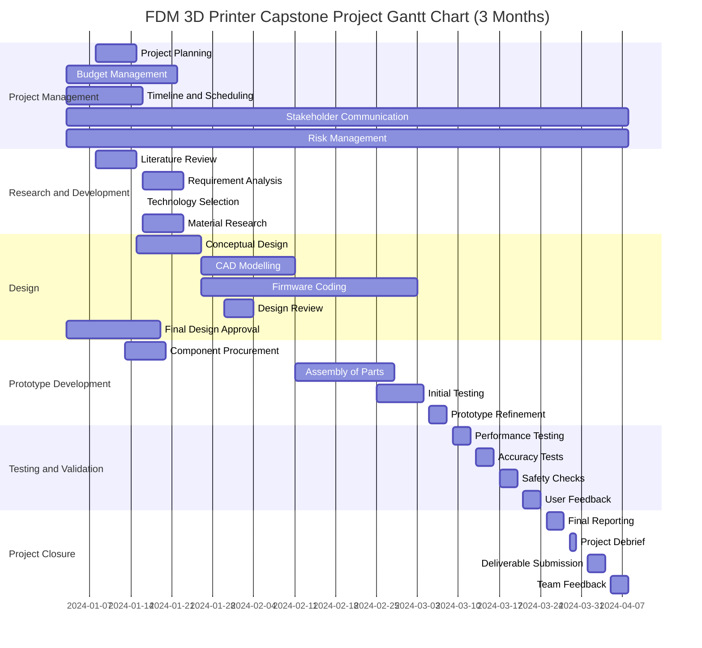

Creating a Gantt chart using Mermaid syntax for your FDM 3D Printer Capstone Project involves laying out the tasks and their respective timelines in a structured format. 

Project started on January 8, 2024, and has a duration of 3 months, it would conclude around April 8, 2024. I'll adjust the Gantt chart to reflect this timeframe:
To maintain the current elements of your Mermaid Gantt chart while ensuring all blocks have the same color, you can assign a custom status to each task with a uniform color code. Mermaid allows you to define custom statuses in the configuration section of the chart. However, it's important to note that some platforms or tools may not support this level of customization in Mermaid syntax.

This Gantt chart now reflects the adjusted project start date of January 8, 2024, and fits the project activities into a 3-month period, ending in early April. You can render this chart using any tool that supports Mermaid syntax. Keep in mind that the exact dates and duration of tasks may need to be tailored to your project's specific requirements and progress.
>>>>>>> e5e28be14c763e54be292e415f540c9c3dd69a7b
