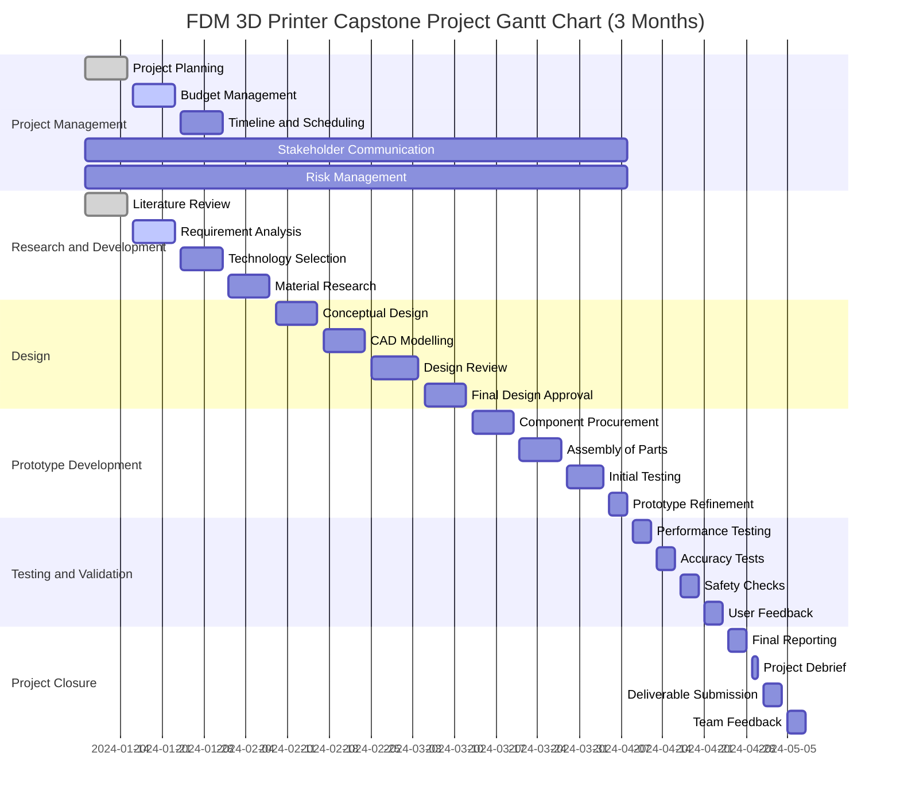

### Updated Proposal for FDM 3D Printer Capstone Project

#### Executive Summary
This proposal outlines a three-month capstone project aimed at designing and developing a functional Fused Deposition Modeling (FDM) 3D Printer. Our focus is on creating a cost-effective, user-friendly, and efficient printer that stands out in the current market. The project will be undertaken by two team members, Thomas Ware and Person B, each bringing unique skills and perspectives to the project.

#### Introduction
The field of 3D printing has seen exponential growth, with FDM being one of the most accessible and popular methods. Despite the variety of FDM printers available, there is still room for innovation, particularly in terms of cost-efficiency, precision, and user experience. This project aims to address these areas while also providing a learning platform for advanced manufacturing technologies.

#### Project Definition and Objectives
**Objective 1:** Design an FDM 3D Printer that is cost-effective and easy to assemble.
**Objective 2:** Ensure the printer achieves high precision and quality in printed objects.
**Objective 3:** Enhance user experience through intuitive design and software integration.

#### Proposed Design (Updated)
Based on the Decision Matrix, our design will focus on a Cartesian FDM Printer model, utilizing a Cartesian coordinate system for accurate navigation and printing precision. The design will feature a compact, modular structure for easy assembly and maintenance. Key components will include a reliable extruder, stable frame, and precise motion control system. Software integration will focus on user-friendly interfaces and compatibility with various printing materials, addressing the versatility seen in different FDM printer types.

#### Technical Challenges (Updated)
1. **Precision Engineering:** Implementing a Cartesian coordinate system for high precision in print quality and motion control, as identified in the Decision Matrix.
2. **Material Compatibility:** Ensuring the printer can handle a range of materials, reflecting the versatility observed in different FDM printer types.
3. **Software Integration:** Developing a user-friendly interface that is robust and versatile, suitable for various printer models and materials.

#### Risks and Benefits
**Risks:** Technical complexities, unforeseen delays, budget constraints.
**Benefits:** Advancement in FDM technology, valuable learning experience, potential for a marketable product.

#### Project Work Breakdown

##### 1. **Project Management**
   - **Duration:** January 8, 2024 - April 8, 2024
   - Planning and organization of the project.
   - Budgeting and financial management.
   - Development of project timeline and scheduling.
   - Regular communication with stakeholders.
   - Identification and management of project risks.

##### 2. **Research and Development**
   - **Duration:** January 8, 2024 - January 31, 2024
   - Conducting a comprehensive literature review on FDM technologies.
   - Analysis of project requirements and specifications.
   - Selection of appropriate FDM technology and materials.
   - Exploration of innovative solutions and improvements.

##### 3. **Design**
   - **Duration:** February 1, 2024 - March 5, 2024
   - Initial conceptualization and design of the FDM printer.
   - Development of CAD models and design simulations.
   - Review and iteration of design prototypes.
   - Finalization and approval of the printer design.

##### 4. **Prototype Development**
   - **Duration:** March 6, 2024 - April 4, 2024
   - Procurement of necessary components and materials.
   - Assembly and integration of printer parts.
   - Conducting initial tests to assess functionality.
   - Refinement and optimization of the prototype.

##### 5. **Testing and Validation**
   - **Duration:** April 5, 2024 - April 24, 2024
   - Comprehensive performance testing of the printer.
   - Verification of print accuracy and resolution.
   - Safety and compliance checks.
   - Collection and analysis of user feedback for further improvements.

##### 6. **Project Closure**
   - **Duration:** April 25, 2024 - April 8, 2024
   - Compilation and submission of the final project report.
   - Project debrief and evaluation of outcomes.
   - Submission of project deliverables.
   - Collection of team feedback and lessons learned.

This Work Breakdown Structure provides a clear and detailed roadmap of the project, with specific time frames for each phase. It ensures that the project progresses in a structured and timely manner, with each phase building upon the completion of the previous one.

#### Team Members and Responsibility Chart

| Team Member | Responsibilities                    |
|-------------|-------------------------------------|
| Person A    | Design, Material Testing, Software  |
| Person B    | Assembly, Quality Control, Marketing|

#### Timeline
**Month 1:** Conceptualization and initial design.
**Month 2:** Prototype development and initial testing.
**Month 3:** Refinement, final testing, and presentation preparation.

#### Gantt Chart
Given that your project started on January 8, 2024, and has a duration of 3 months, it would conclude around April 8, 2024. I'll adjust the Gantt chart to reflect this timeframe:

This Gantt chart now reflects the adjusted project start date of January 8, 2024, and fits the project activities into a 3-month period, ending in early April. You can render this chart using any tool that supports Mermaid syntax. Keep in mind that the exact dates and duration of tasks may need to be tailored to your project's specific requirements and progress.

This project promises to be a significant contribution to the field of FDM 3D printing, blending innovation with practical design and functionality. The collaboration between Person A and Person B, with their combined skills and knowledge, is pivotal to the success of this ambitious project.
>>>>>>> e5e28be14c763e54be292e415f540c9c3dd69a7b
