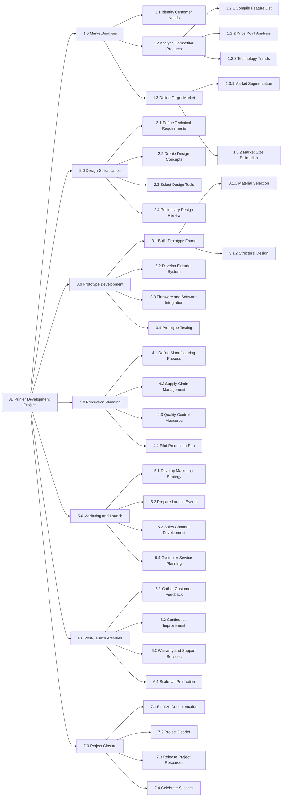

Creating a Work Breakdown Structure (WBS) for your project involves breaking down the project into smaller, more manageable components. Since you mentioned a project related to a "FDM 3D Printer Capstone Project," I'll use this as a basis to create a generic WBS for such a project. However, please note that the specifics might vary depending on the details of your project.

Here's a general outline for a Work Breakdown Structure for an FDM 3D Printer Capstone Project:

#### Project Work Breakdown

##### 1. **Project Management**
   - **Duration:** January 8, 2024 - April 8, 2024
   - Planning and organization of the project.
   - Budgeting and financial management.
   - Development of project timeline and scheduling.
   - Regular communication with stakeholders.
   - Identification and management of project risks.

##### 2. **Research and Development**
   - **Duration:** January 3, 2024 - January 31, 2024
   - Conducting a comprehensive literature review on FDM technologies.
   - Analysis of project requirements and specifications.
   - Selection of appropriate FDM technology and materials.
   - Exploration of innovative solutions and improvements.

##### 3. **Design**
   - **Duration:** January 15, 2024 - March 20, 2024
   - Initial conceptualization and design of the FDM printer.
   - Development of CAD models and design simulations.
   - Review and iteration of design prototypes.
   - Finalization and approval of the printer design.

##### 4. **Prototype Development**    
   - **Duration:** January 13, 2024 - March 3, 2024
   - Procurement of necessary components and materials.
   - Assembly and integration of printer parts.
   - Conducting initial tests to assess functionality.
   - Refinement and optimization of the prototype.

##### 5. **Testing and Validation**
   - **Duration:** February 24, 2024 - March 12, 2024  
   - Comprehensive performance testing of the printer.
   - Verification of print accuracy and resolution.
   - Safety and compliance checks.
   - Collection and analysis of user feedback for further improvements.

##### 6. **Project Closure**
   - **Duration:** March 24, 2024 - April 8, 2024
   - Compilation and submission of the final project report.
   - Project debrief and evaluation of outcomes.
   - Submission of project deliverables.
   - Collection of team feedback and lessons learned.

This Work Breakdown Structure provides a clear and detailed roadmap of the project, with specific time frames for each phase. It ensures that the project progresses in a structured and timely manner, with each phase building upon the completion of the previous one.

This structure should be adapted based on the specific goals, resources, and constraints of your project. Each of these main categories can be further broken down into sub-tasks as needed. Would you like me to create a visual representation of this WBS?

---
Modify the project description in the Mermaid diagram to reflect a new project theme focused on 3D Printer Development. Here's the revised Mermaid syntax:

This diagram describes a project focused on developing a 3D printer, with various stages from market analysis to project closure, including prototype development and production planning. Each stage includes relevant tasks and sub-tasks that might be part of a 3D printer development project.

>>>>>>> e5e28be14c763e54be292e415f540c9c3dd69a7b
