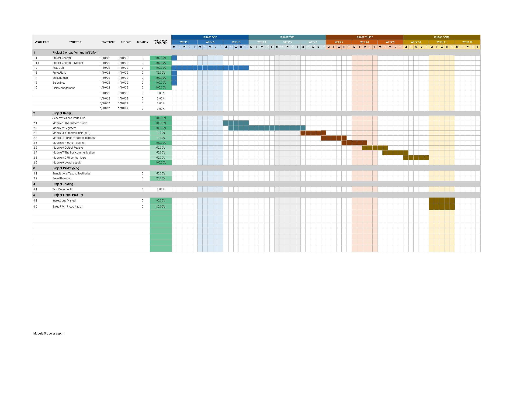

# 🧠 8‑Bit Computer Capstone Project

A handcrafted, modular 8‑bit computer built using TTL logic ICs — inspired by Ben Eater’s architecture — developed as part of an academic engineering capstone. This repository includes all project documentation, build instructions, diagrams, and supporting references.



---

## 🎯 Project Objective

To design, build, and validate a fully functional 8‑bit CPU using only discrete components (no microcontrollers). The computer executes simple programs by coordinating a clock, registers, program counter, ALU, memory, and control logic — all built from the ground up using 74LS-series logic chips on a breadboard.

This project demonstrates core competencies in:
- Digital logic and microarchitecture
- Circuit analysis and prototyping
- Hardware timing and clock signal management
- Technical documentation and engineering process

---

## 🧩 Core Features

- ✅ **Modular Hardware Design**: Includes ALU, Program Counter, Registers, Clock, Instruction Decoder, RAM, and ROM
- 🧠 **TTL Logic Only**: Built entirely from 74LS-series integrated circuits
- 🧪 **Step-by-Step Testing**: Debugged and validated one module at a time
- 📄 **Complete Documentation**: Includes project charter, Gantt chart, ELTR course overview, and learning resources
- 🛠️ **No Programming Required**: Machine code is programmed into EEPROM manually

---

## 📁 Folder Structure

```plaintext
8-Bit-Computer-Capstone/
├── docs/               # Project documents, reports, and guides
│   ├── ELTR-Course-Overview.docx
│   ├── Project-Charter.docx
│   └── Getting-Started.pdf
├── assets/             # Project visuals, diagrams, and media
│   └── gantt-chart.jpg
├── src/                # Logic circuit schematics, breadboard layouts
│   ├── logic-circuits/
│   └── breadboard-layouts/
├── references/         # External datasheets and technical references
│   └── Data Sheets.zip
├── notes/              # Markdown notes and file planning
│   ├── Ben Eater's 8-bit Project.md
│   └── file setup.txt
├── .gitignore
├── LICENSE
└── README.md
````

---

## 🚀 Getting Started

To view or reproduce this project:

1. **Clone the repository**:

   ```bash
   git clone https://github.com/YOUR-USERNAME/8-Bit-Computer-Capstone.git
   cd 8-Bit-Computer-Capstone
   ```

2. **Read the documentation**:

   * Open `docs/Getting-Started.pdf` to begin
   * Review the logic circuit layout and component list in `src/`

3. **Build it on Breadboards**:

   * Follow the layout diagrams
   * Use IC datasheets in `references/` for wiring instructions

---

## ⚙️ Requirements

**Hardware**:

* 6× Breadboards
* Assorted 74LS series logic ICs (e.g., 74LS00, 74LS04, 74LS161, 74LS173)
* EEPROM (e.g., AT28C64 or 28C16)
* LEDs, resistors, push-buttons, clock generator (555 timer or oscillator)
* 5V regulated power supply
* Jumper wires

**Optional Tools**:

* Logic analyzer or oscilloscope
* IC puller, EEPROM programmer

---

## 📅 Milestones

| Milestone              | Status      | Date         |
| ---------------------- | ----------- | ------------ |
| Project Concept        | ✅ Complete  | Feb 2025     |
| Design & Documentation | ✅ Complete  | Mar 2025     |
| Module Testing         | 🔄 Ongoing  | Apr–May 2025 |
| Final Assembly         | 🔲 Upcoming | June 2025    |

---

## 👤 Author

**Thomas Ware**
Capstone Project Developer – Automation & Electronics Student
🔗 [LinkedIn Profile](https://www.linkedin.com/in/thomas-ware-83395473/)

---

## 📄 License

This project is licensed under the [MIT License](LICENSE).

---

## 🙏 Acknowledgments

* [Ben Eater](https://eater.net/) for his educational 8-bit computer series
* University of the Fraser Valley – ELTR Program
* Fellow classmates, instructors, and mentors for their support
