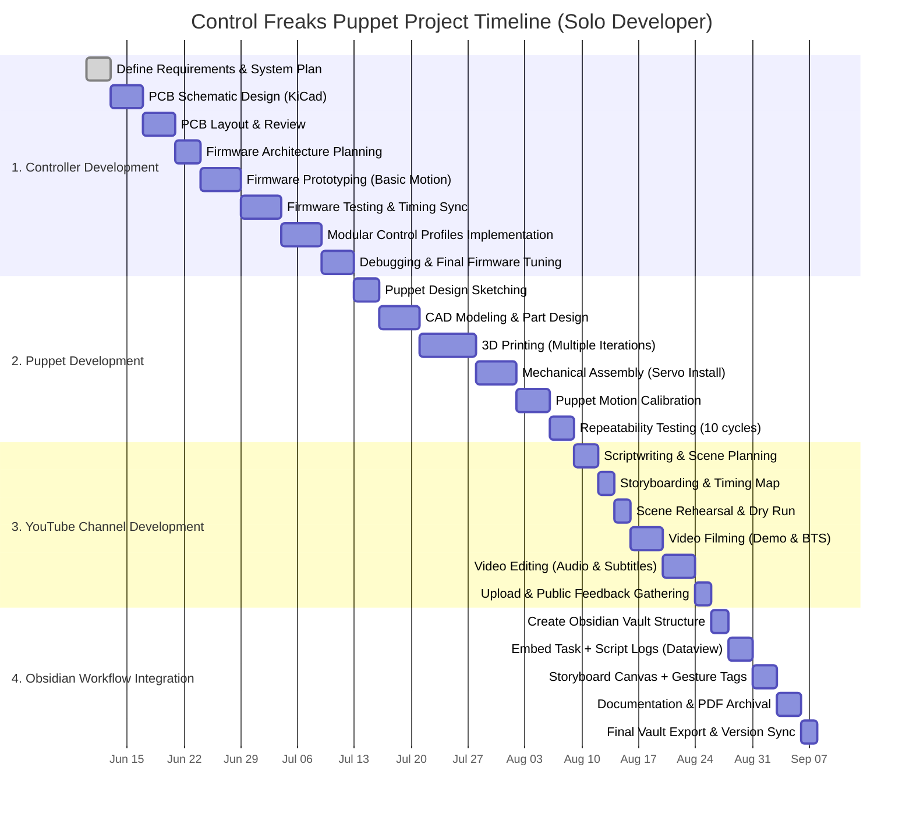

```mermaid
gantt
    title Control Freaks Puppet Project Timeline (Solo Developer)
    dateFormat  YYYY-MM-DD
    axisFormat  %b %d

    section 1. Controller Development
    Define Requirements & System Plan      :done,    t01, 2025-06-10, 3d
    PCB Schematic Design (KiCad)           :         t02, after t01, 4d
    PCB Layout & Review                    :         t03, after t02, 4d
    Firmware Architecture Planning         :         t04, after t03, 3d
    Firmware Prototyping (Basic Motion)    :         t05, after t04, 5d
    Firmware Testing & Timing Sync         :         t06, after t05, 5d
    Modular Control Profiles Implementation:         t07, after t06, 5d
    Debugging & Final Firmware Tuning      :         t08, after t07, 4d

    section 2. Puppet Development
    Puppet Design Sketching                :         t09, after t08, 3d
    CAD Modeling & Part Design             :         t10, after t09, 5d
    3D Printing (Multiple Iterations)      :         t11, after t10, 7d
    Mechanical Assembly (Servo Install)    :         t12, after t11, 5d
    Puppet Motion Calibration              :         t13, after t12, 4d
    Repeatability Testing (10 cycles)      :         t14, after t13, 3d

    section 3. YouTube Channel Development
    Scriptwriting & Scene Planning         :         t15, after t14, 3d
    Storyboarding & Timing Map             :         t16, after t15, 2d
    Scene Rehearsal & Dry Run              :         t17, after t16, 2d
    Video Filming (Demo & BTS)             :         t18, after t17, 4d
    Video Editing (Audio & Subtitles)      :         t19, after t18, 4d
    Upload & Public Feedback Gathering     :         t20, after t19, 2d

    section 4. Obsidian Workflow Integration
    Create Obsidian Vault Structure        :         t21, after t20, 2d
    Embed Task + Script Logs (Dataview)    :         t22, after t21, 3d
    Storyboard Canvas + Gesture Tags       :         t23, after t22, 3d
    Documentation & PDF Archival           :         t24, after t23, 3d
    Final Vault Export & Version Sync      :         t25, after t24, 2d


```
