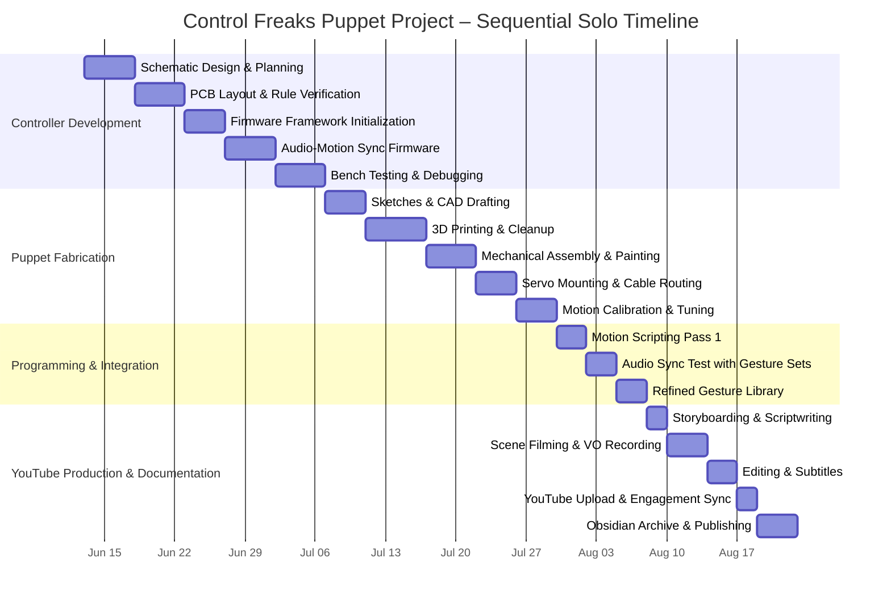

```mermaid
gantt
    title Control Freaks Puppet Project – Sequential Solo Timeline
    dateFormat  YYYY-MM-DD
    axisFormat  %b %d

    section Controller Development
    Schematic Design & Planning             :t01, 2025-06-13, 5d
    PCB Layout & Rule Verification          :t02, after t01, 5d
    Firmware Framework Initialization       :t03, after t02, 4d
    Audio-Motion Sync Firmware              :t04, after t03, 5d
    Bench Testing & Debugging               :t05, after t04, 5d

    section Puppet Fabrication
    Sketches & CAD Drafting                 :t06, after t05, 4d
    3D Printing & Cleanup                   :t07, after t06, 6d
    Mechanical Assembly & Painting          :t08, after t07, 5d
    Servo Mounting & Cable Routing          :t09, after t08, 4d
    Motion Calibration & Tuning             :t10, after t09, 4d

    section Programming & Integration
    Motion Scripting Pass 1                 :t11, after t10, 3d
    Audio Sync Test with Gesture Sets       :t12, after t11, 3d
    Refined Gesture Library                 :t13, after t12, 3d

    section YouTube Production & Documentation
    Storyboarding & Scriptwriting           :t14, after t13, 2d
    Scene Filming & VO Recording            :t15, after t14, 4d
    Editing & Subtitles                     :t16, after t15, 3d
    YouTube Upload & Engagement Sync        :t17, after t16, 2d
    Obsidian Archive & Publishing           :t18, after t17, 4d

```
