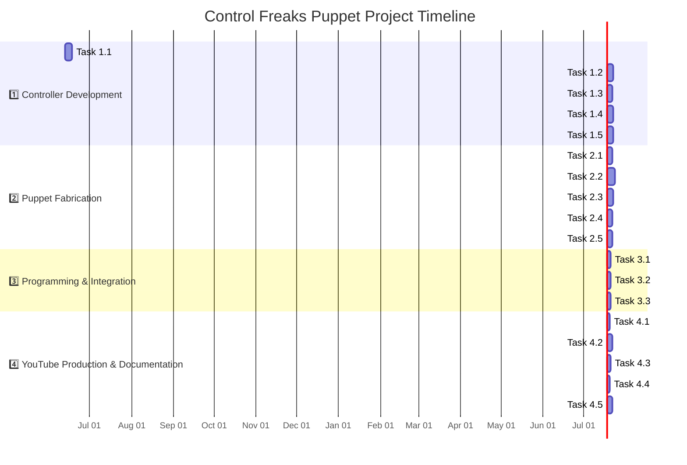

```mermaid
gantt
    title Control Freaks Puppet Project Timeline
    dateFormat  YYYY-MM-DD
    axisFormat  %b %d

    section 1️⃣ Controller Development
    Task 1.1: Schematic Design & Planning        :t01, 2025-06-13, 5d
    Task 1.2: PCB Layout & Rule Verification     :t02, after t01, 5d
    Task 1.3: Firmware Framework Initialization  :t03, after t02, 4d
    Task 1.4: Audio-Motion Sync Firmware         :t04, after t03, 5d
    Task 1.5: Bench Testing & Debugging          :t05, after t04, 5d

    section 2️⃣ Puppet Fabrication
    Task 2.1: Sketches & CAD Drafting            :t06, after t05, 4d
    Task 2.2: 3D Printing & Cleanup              :t07, after t06, 6d
    Task 2.3: Mechanical Assembly & Painting     :t08, after t07, 5d
    Task 2.4: Servo Mounting & Cable Routing     :t09, after t08, 4d
    Task 2.5: Motion Calibration & Tuning        :t10, after t09, 4d

    section 3️⃣ Programming & Integration
    Task 3.1: Motion Scripting Pass 1            :t11, after t10, 3d
    Task 3.2: Audio Sync Test with Gesture Sets  :t12, after t11, 3d
    Task 3.3: Refined Gesture Library            :t13, after t12, 3d

    section 4️⃣ YouTube Production & Documentation
    Task 4.1: Storyboarding & Scriptwriting      :t14, after t13, 2d
    Task 4.2: Scene Filming & VO Recording       :t15, after t14, 4d
    Task 4.3: Editing & Subtitles                :t16, after t15, 3d
    Task 4.4: YouTube Upload & Engagement Sync   :t17, after t16, 2d
    Task 4.5: Obsidian Archive & Publishing      :t18, after t17, 4d
```
