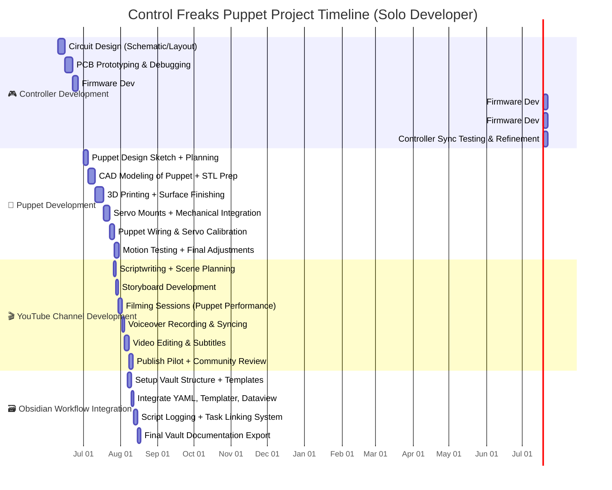

```mermaid
gantt
    title Control Freaks Puppet Project Timeline (Solo Developer)
    dateFormat  YYYY-MM-DD
    axisFormat  %b %d

    %% PHASE 1: Controller Development
    section 🎮 Controller Development
    Circuit Design (Schematic/Layout)       :c1, 2025-06-10, 6d
    PCB Prototyping & Debugging             :c2, after c1, 6d
    Firmware Dev: Basic Motion Control      :c3, after c2, 5d
    Firmware Dev: Audio-Motion Sync         :c4, after c3, 4d
    Firmware Dev: Profile & Modularization  :c5, after c4, 4d
    Controller Sync Testing & Refinement    :c6, after c5, 4d

    %% PHASE 2: Puppet Development
    section 🤖 Puppet Development
    Puppet Design Sketch + Planning         :p1, 2025-07-01, 4d
    CAD Modeling of Puppet + STL Prep       :p2, after p1, 6d
    3D Printing + Surface Finishing         :p3, after p2, 7d
    Servo Mounts + Mechanical Integration   :p4, after p3, 5d
    Puppet Wiring & Servo Calibration       :p5, after p4, 4d
    Motion Testing + Final Adjustments      :p6, after p5, 4d

    %% PHASE 3: YouTube Channel Development
    section 🎬 YouTube Channel Development
    Scriptwriting + Scene Planning          :y1, 2025-07-26, 2d
    Storyboard Development                  :y2, after y1, 2d
    Filming Sessions (Puppet Performance)   :y3, after y2, 3d
    Voiceover Recording & Syncing           :y4, after y3, 2d
    Video Editing & Subtitles               :y5, after y4, 4d
    Publish Pilot + Community Review        :y6, after y5, 3d

    %% PHASE 4: Obsidian Workflow Integration
    section 🗃 Obsidian Workflow Integration
    Setup Vault Structure + Templates       :o1, 2025-08-07, 3d
    Integrate YAML, Templater, Dataview     :o2, after o1, 2d
    Script Logging + Task Linking System    :o3, after o2, 3d
    Final Vault Documentation Export        :o4, after o3, 3d
```
