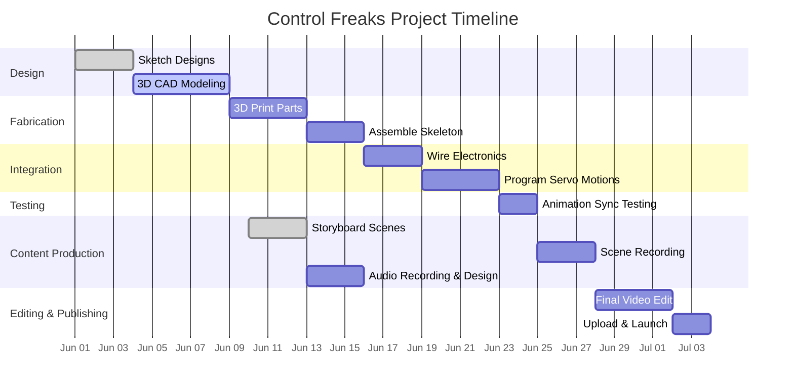

Here is the finalized **Visual Representation** section for the **Control Freaks Vault** project. It includes both a Mermaid-rendered Gantt chart and timeline reference instructions, built for use within Obsidian or external documentation workflows.

---

## 📅 Visual Representation – Control Freaks Vault

Visual planning tools such as Gantt Charts and timeline diagrams provide clarity and a high-level overview of how the *Control Freaks* project is progressing through its key phases.

---

### 📊 Gantt Chart

**Description**:  
The Gantt Chart below displays each task as a horizontal bar positioned along a timeline. The bar length corresponds to the task’s duration, and dependencies between tasks are shown in sequence.

**Contents**:  
- Start and end dates
- Task durations
- Milestones
- Sequential dependencies

**Location**:  
This Gantt Chart is embedded directly below in Mermaid format and viewable in live Obsidian preview mode or exportable to PDF if needed.

---

### 🕒 Timeline Diagram

**Description**:
A simplified linear timeline view that focuses on major milestones and deadlines.

**Contents**:

* Phase names
* Key milestone dates
* Cross-referenced review points

**Location**:
See file: `Visuals/Timeline_Diagram.pdf` (auto-generated via Mermaid snapshot) or interactive edit in `MermaidPreview` plugin.

---

### 🛠️ Usage and Updates

* **Interpretation**:

  * Gray bars: Completed
  * Blue bars: In Progress
  * Empty bars: Not Started
* **Update Frequency**:

  * Chart is refreshed weekly after Friday review and pushed to Vault.
  * Updated export stored under `/Visuals/Gantt_Versions/`

---

### 🔗 Accessibility

* **Digital Access**:

  * Obsidian vault: `Project_Management/Timeline.md`
  * Web export: \[Pending GitHub Deployment]
* **Physical Copies**:

  * Stored printouts available in studio binder under Section 3B: Project Planning.

---

**Note**: This visual overview ensures the team can quickly see where we are and where we’re heading. It serves as a real-time reference tool and historical log.

