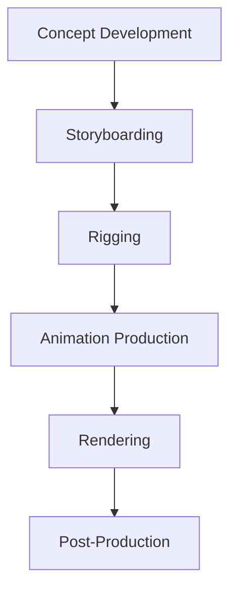

# **Animation Workflow Diagram**

## **Project:** 3D Puppet Design

---

## **1. Overview**
This document outlines the animation workflow for the **3D Puppet Design** project, providing a clear sequence of steps and responsibilities to streamline production.

---

## **2. Workflow Phases**

### **A. Pre-Production**
1. **Concept Development:**
   - Create sketches and mood boards to define the character’s personality and movement style.
   - Gather stakeholder feedback to finalize the concept.
2. **Storyboarding:**
   - Develop storyboards to visualize key movements and camera angles.
   - Define action sequences and timing.

### **B. Rigging**
1. **Skeleton Creation:**
   - Build a skeleton using bones and control rigs.
   - Ensure proper joint placement for realistic articulation.
2. **Weight Painting:**
   - Assign vertex weights to bones for smooth deformations.
3. **IK/FK Setup:**
   - Implement Inverse Kinematics (IK) and Forward Kinematics (FK) for versatile motion.

### **C. Animation Production**
1. **Blocking:**
   - Establish key poses and movements to define the overall flow.
   - Focus on primary actions without details.
2. **Splining:**
   - Refine transitions between keyframes for fluid motion.
3. **Polishing:**
   - Add secondary motion, such as hair and clothing dynamics.
   - Fine-tune timing and expressions.

### **D. Rendering**
1. **Scene Setup:**
   - Adjust lighting and camera angles to highlight animation details.
   - Verify all assets and textures are in place.
2. **Rendering:**
   - Render animations in high resolution and appropriate formats.
3. **Quality Check:**
   - Inspect renders for artifacts, missing frames, or timing issues.

### **E. Post-Production**
1. **Editing:**
   - Compile rendered sequences into a final video.
   - Add sound effects, background music, and text overlays.
2. **Stakeholder Review:**
   - Present the final animation for approval.
   - Incorporate feedback and finalize.

---

## **3. Workflow Diagram**

---

## **4. Tools and Resources**
- **Blender:** For rigging, animation, and rendering.
- **Premiere Pro/DaVinci Resolve:** For video editing.
- **Slack:** For team communication and feedback.

---

## **5. Best Practices**
1. **Iterate Frequently:**
   - Review each phase with the team and stakeholders to ensure alignment.
2. **Document Changes:**
   - Maintain logs of feedback and updates to track progress.
3. **Optimize Workflow:**
   - Automate repetitive tasks, such as batch rendering, to save time.

---

**Prepared by:** [Your Name]  
**Date:** [Insert Date]