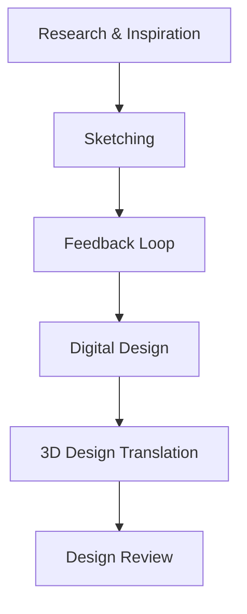

# **Design Workflow Diagram**

## **Project:** 3D Puppet Design

---

## **1. Overview**
This document outlines the design workflow for the **3D Puppet Design** project, detailing each phase to ensure efficient collaboration and high-quality outputs.

---

## **2. Workflow Phases**

### **A. Concept Development**
1. **Research and Inspiration:**
   - Collect references and create mood boards.
   - Define the visual style and thematic elements.
2. **Sketching:**
   - Develop initial concept sketches.
   - Focus on key features and proportions.
3. **Feedback Loop:**
   - Present sketches to stakeholders for input.
   - Refine designs based on feedback.

### **B. Digital Design**
1. **Detailed Sketching:**
   - Transition from rough sketches to detailed drawings.
   - Finalize proportions and include material notes.
2. **Color Studies:**
   - Experiment with color palettes to match the "Mad Scientist" theme.
3. **Approval:**
   - Submit final designs for stakeholder approval.

### **C. 3D Design Translation**
1. **Base Modeling:**
   - Create the 3D base model from approved sketches.
   - Ensure accurate proportions and topology.
2. **Texturing and Materials:**
   - Apply textures and test materials for visual consistency.
3. **Initial Rigging:**
   - Prepare the model for animation by adding a basic rig.

### **D. Design Review**
1. **Internal Review:**
   - Evaluate the design for consistency and quality.
2. **Stakeholder Review:**
   - Present the design for final feedback.
   - Incorporate changes and finalize.

---

## **3. Workflow Diagram**

---

## **4. Tools and Resources**
- **Procreate/Photoshop:** For sketching and digital painting.
- **Blender:** For 3D modeling and texturing.
- **Slack:** For communication and feedback.

---

## **5. Best Practices**
1. **Collaborate Frequently:**
   - Share progress regularly to align with team and stakeholder expectations.
2. **Maintain Documentation:**
   - Keep a record of feedback and design iterations.
3. **Test Early:**
   - Validate designs through test renders and prototypes before finalization.

---

**Prepared by:** [Your Name]  
**Date:** [Insert Date]
