---
# 📊 Gantt Chart

- **Schedule Representation**: Timeline showing tasks, duration, dependencies.

---
A Gantt Chart is an essential project management tool that visually represents the schedule of the **Control Freaks Puppet Project**. It displays the start and end dates, duration, and dependencies of each task in a clear, linear format—supporting effective solo task management, planning, and coordination.

---

## 📅 Gantt Chart – Control Freaks Puppet Project

### 🔍 Overview

- **Purpose**: This Gantt Chart serves as a visual representation of the project's timeline. It details the sequential flow of tasks across the four project phases:  
  1. Controller Development  
  2. Puppet Development  
  3. Show Pipeline Development  
  4. Obsidian Vault Integration  
- The timeline emphasizes the **solo developer constraint**: all tasks are performed strictly **one at a time**, with no parallel execution.

---

### 🧱 Components

- **Tasks**: Each task is labeled with its unique task ID (e.g., `CD-T01`, `PD-T05`, etc.) and linked to the corresponding deliverable in the PARA task registry.
- **Duration**: Each task includes exact day spans defined in its YAML metadata.
- **Start/End Dates**: Pulled from the validated "New CFV Tasks" directory.
- **Dependencies**: Enforced via the `after` clause in the Mermaid syntax, maintaining strict sequential flow.

---

### 📈 Visual Representation

```mermaid
gantt
    title Control Freaks Puppet Project – Full Timeline
    dateFormat  YYYY-MM-DD
    axisFormat  %b %d

    section 🧠 Controller Development
    CD-T01 - Define controller board specs   :cd01, 2025-06-15, 5d
    CD-T02 - Research MCU + power needs      :cd02, after cd01, 5d
    CD-T03 - Schematic layout + libraries    :cd03, after cd02, 4d
    CD-T04 - PCB layout + validation         :cd04, after cd03, 5d
    CD-T05 - Order prototype PCBs            :cd05, after cd04, 1d
    CD-T06 - Solder components + smoke test  :cd06, after cd05, 4d
    CD-T07 - Flash bootloader + debug        :cd07, after cd06, 3d
    CD-T08 - Write firmware for servo I/O    :cd08, after cd07, 5d
    CD-T09 - Add audio sync + serial         :cd09, after cd08, 5d
    CD-T10 - Test full board + fallback plan :cd10, after cd09, 4d

    section 🎭 Puppet Development
    PD-T01 - Sculpt head, record refs        :pd01, after cd10, 3d
    PD-T02 - CAD skull structure + jaw rig   :pd02, after pd01, 4d
    PD-T03 - Print + test mechanical joints  :pd03, after pd02, 3d
    PD-T04 - Mount servos and pulley system  :pd04, after pd03, 4d
    PD-T05 - Fit latex skin + facial shape   :pd05, after pd04, 4d
    PD-T06 - Embed LED eyes + wire routing   :pd06, after pd05, 3d
    PD-T07 - Assemble full puppet            :pd07, after pd06, 3d

    section 🎬 Show Pipeline Development
    SP-T01 - Draft short script              :sp01, after pd07, 2d
    SP-T02 - Program keyframe sequence       :sp02, after sp01, 3d
    SP-T03 - Integrate voice + movement      :sp03, after sp02, 3d
    SP-T04 - Run full show cycle + tune      :sp04, after sp03, 3d
    SP-T05 - Record puppet test performance  :sp05, after sp04, 2d

    section 📁 Obsidian Vault Integration
    OV-T01 - Setup PARA folders + metadata   :ov01, after sp05, 2d
    OV-T02 - Tag and link tasks to Milestones:ov02, after ov01, 1d
    OV-T03 - Finalize vault for publishing   :ov03, after ov02, 2d
```

---

### 🔗 Integration with Project Plan

- **WBS Alignment**: The chart strictly follows the **Work Breakdown Structure**, with task IDs grouped under their corresponding phases.
- **Resource Allocation**: Each task reflects the timeline of a **solo developer**, respecting both feasibility and flow.

---

### 📈 Progress Tracking

- **Milestones**: Clearly represented as task boundaries (e.g., end of `CD-T10`, `PD-T07`, etc.).
- **Update Protocol**: The chart is updated weekly during Progress Sync sessions. All changes are committed to the Vault.

---

### 🛠 Usage

- **Tool for Solo Dev**: Serves as the master tracker of all deliverables, durations, and inter-task logic.
- **Stakeholder Transparency**: Supports presentation-ready formatting for instructors, sponsors, and YouTube update videos.

---

This **Gantt Chart** is a foundational visual tool for ensuring the **Control Freaks Puppet Project** remains on track. It enforces logical task progression, buffers realistic durations, and aligns with overall milestones and dependencies to maintain clarity and deliverability.

---

🔗 **Related Documents**
- `Tasks - Note.md`
- `04.WBS.md`
- `01.Milestones.md`

📁 **Location in PARA Framework**  
`/02.Areas/How to Setup the Project Guidlines/07.Resources and Documents/Document Managment/05.Timeline.md`
