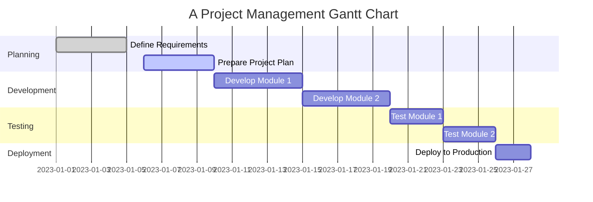

```mermaid
gantt
    title A Project Management Gantt Chart
    dateFormat  YYYY-MM-DD
    section Planning
    Define Requirements   :done,    des1, 2023-01-01, 2023-01-05
    Prepare Project Plan  :active,  des2, 2023-01-06, 2023-01-10
    section Development
    Develop Module 1      :         des3, after des2, 5d
    Develop Module 2      :         des4, after des3, 5d
    section Testing
    Test Module 1         :         des5, after des4, 3d
    Test Module 2         :         des6, after des5, 3d
    section Deployment
    Deploy to Production  :         des7, after des6, 2d

```
