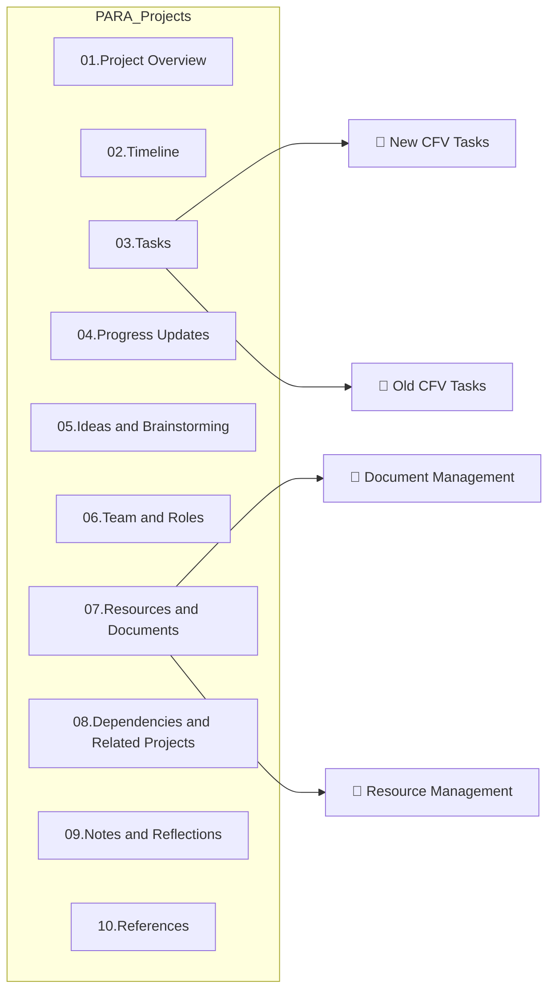

```mermaid
graph LR
  PARA_Projects["📁 Projects"]

  subgraph PARA_Projects
    P01["01.Project Overview"]
    P02["02.Timeline"]
    P03["03.Tasks"]
    P04["04.Progress Updates"]
    P05["05.Ideas and Brainstorming"]
    P06["06.Team and Roles"]
    P07["07.Resources and Documents"]
    P08["08.Dependencies and Related Projects"]
    P09["09.Notes and Reflections"]
    P10["10.References"]
  end

  %% Subfolders within 07.Resources and Documents
  P07_D1["📁 Document Management"]
  P07_D2["📁 Resource Management"]
  P07 --> P07_D1
  P07 --> P07_D2

  %% Subfolders within 03.Tasks
  P03_N1["📁 New CFV Tasks"]
  P03_N2["📁 Old CFV Tasks"]
  P03 --> P03_N1
  P03 --> P03_N2
```
