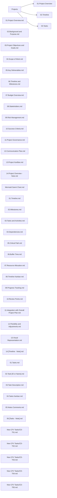

```mermaid
graph LR
  P["Projects"]
  01_Project_Overview["01.Project Overview"]
  01_Project_Overview__01_Project_Overview_md["01.Project Overview.md"]
  01_Project_Overview__02_Background_and_Purpose_md["02.Background and Purpose.md"]
  01_Project_Overview__03_Project_Objectives_and_Goals_md["03.Project Objectives and Goals.md"]
  01_Project_Overview__04_Scope_of_Work_md["04.Scope of Work.md"]
  01_Project_Overview__05_Key_Deliverables_md["05.Key Deliverables.md"]
  01_Project_Overview__06_Timeline_and_Milestones_md["06.Timeline and Milestones.md"]
  01_Project_Overview__07_Budget_Overview_md["07.Budget Overview.md"]
  01_Project_Overview__08_Stakeholders_md["08.Stakeholders.md"]
  01_Project_Overview__09_Risk_Management_md["09.Risk Management.md"]
  01_Project_Overview__10_Success_Criteria_md["10.Success Criteria.md"]
  01_Project_Overview__11_Project_Governance_md["11.Project Governance.md"]
  01_Project_Overview__12_Communication_Plan_md["12.Communication Plan.md"]
  01_Project_Overview__13_Project_KanBan_md["13.Project KanBan.md"]
  01_Project_Overview__14_Project_Overview_-_Note_md["14.Project Overview - Note.md"]
  01_Project_Overview__Mermaid_Gannt_Chart_md["Mermaid Gannt Chart.md"]
  02_Timeline["02.Timeline"]
  02_Timeline__01_Timeline_md["01.Timeline.md"]
  02_Timeline__02_Milestones_md["02.Milestones.md"]
  02_Timeline__03_Tasks_and_Activities_md["03.Tasks and Activities.md"]
  02_Timeline__04_Dependencies_md["04.Dependencies.md"]
  02_Timeline__05_Critical_Path_md["05.Critical Path.md"]
  02_Timeline__06_Buffer_Time_md["06.Buffer Time.md"]
  02_Timeline__07_Resource_Allocation_md["07.Resource Allocation.md"]
  02_Timeline__08_Timeline_Kanban_md["08.Timeline Kanban.md"]
  02_Timeline__09_Progress_Tracking_md["09.Progress Tracking.md"]
  02_Timeline__10_Review_Points_md["10.Review Points.md"]
  02_Timeline__11_Integration_with_Overall_Project_Plan_md["11.Integration with Overall Project Plan.md"]
  02_Timeline__12_Flexibility_and_Adjustments_md["12.Flexibility and Adjustments.md"]
  02_Timeline__13_Visual_Representation_md["13.Visual Representation.md"]
  02_Timeline__14__Timeline_-_Note_md["14.[Timeline - Note].md"]
  03_Tasks["03.Tasks"]
  03_Tasks__01_Tasks_md["01.Tasks.md"]
  03_Tasks__02_Task__ID_or_Name__md["02.Task [ID or Name].md"]
  03_Tasks__03_Task_Description_md["03.Task Description.md"]
  03_Tasks__04_Tasks_Kanban_md["04.Tasks Kanban.md"]
  03_Tasks__05_Notes_Comments_md["05.Notes Comments.md"]
  03_Tasks__06__Tasks_-_Note__md["06.[Tasks - Note].md"]
  03_Tasks__New_CFV_Tasks_CD_T01_md["New CFV Tasks/CD-T01.md"]
  03_Tasks__New_CFV_Tasks_CD_T02_md["New CFV Tasks/CD-T02.md"]
  03_Tasks__New_CFV_Tasks_CD_T03_md["New CFV Tasks/CD-T03.md"]
  03_Tasks__New_CFV_Tasks_CD_T04_md["New CFV Tasks/CD-T04.md"]
  03_Tasks__New_CFV_Tasks_CD_T05_md["New CFV Tasks/CD-T05.md"]
  P --> 01_Project_Overview
  P --> 02_Timeline
  P --> 03_Tasks
```

