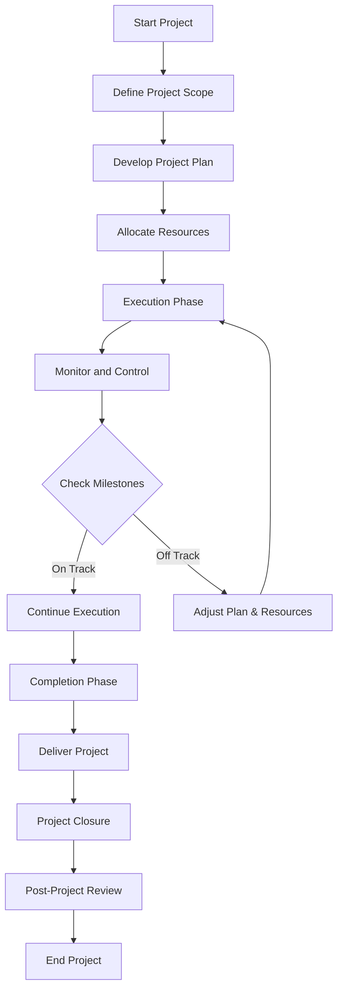

Here's an example of a Mermaid flowchart that visualizes a typical project management process:

---
In this flowchart:
- The project starts and then moves into defining the project scope.
- After the scope is defined, a detailed project plan is developed.
- Resources are then allocated based on the project plan.
- The project enters the execution phase, during which project activities are carried out.
- During execution, ongoing monitoring and control processes are in place.
- Regularly, the project's progress is checked against milestones.
- If the project is on track, execution continues; if off track, the plan and resources are adjusted.
- Eventually, the project moves into the completion phase.
- The project is then delivered, followed by project closure activities.
- A post-project review is conducted to gather learnings and best practices.
- Finally, the project is officially ended.