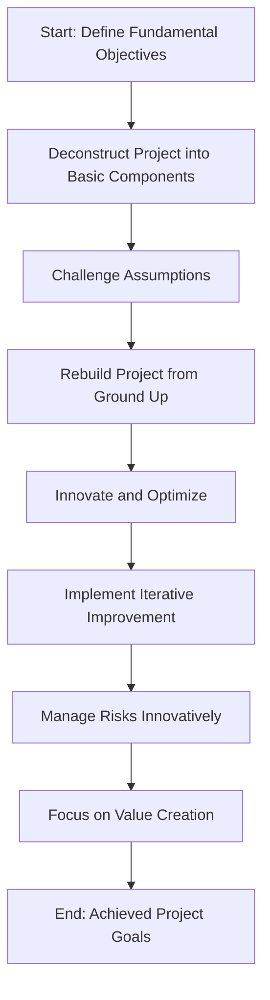

---
title:
---

---
To apply the First Principles approach to the structure outlined in the provided markdown table, we'll align each step in the methodology with relevant files and directories from the project. This alignment will help in restructuring the project management process based on fundamental objectives and components.

1. **Identify the Fundamental Objectives**
   - Files: `2. Project Objectives and Goals.md` in "Project Overview" directory
   - [[2. Project Objectives and Goals]]
   - Purpose: Define the core objectives and goals of the project.

2. **Deconstruct Project into Basic Components**
   - Files: `3. Scope of Work.md`, `4. Key Deliverables.md` in "Project Overview" directory
-  [[3. Scope of Work]]   
- [[4. Key Deliverables]]
   - Purpose: Understand the fundamental tasks, resources, and deliverables.

3. **Challenge Assumptions**
   - Files: All files under "Notes and Reflections" and "Dependencies and Related Projects"
   - Purpose: Question traditional methods and assumptions in project planning and execution.

4. **Rebuild Project from Ground Up**
   - Files: `Project Overview.md`, `1. Background and Purpose.md`, `5. Timeline and Milestones.md`
   - [[1 Projects/Projects - New Project/Project Overview/Project Overview]]
   - [[1. Background and Purpose]]
   - [[5. Timeline and Milestones]]
   - Purpose: Use insights from the deconstruction phase to rebuild the project plan with a focus on efficiency and effectiveness.

5. **Innovate and Optimize**
   - Files: `Ideas and Brainstorming`, `Tasks`, `Team and Roles`
   - [[Ideas and Brainstorming]]
   - [[Tasks]]
   - [[Team and Roles]]
   - Purpose: Look for innovative approaches in task allocation, team structure, and project methodologies.

6. **Implement Iterative Improvement**
   - Files: `Progress Updates`, `Notes and Reflections`
   - [[Progress Updates]]
   - [[Notes and Reflections]]
   - Purpose: Use feedback and reflections to refine and improve the project approach continuously.

7. **Manage Risks Innovatively**
   - Files: `8. Risk Management.md` in "Project Overview", `Dependencies and Related Projects`
   - [[8. Risk Management]]
   - [[Dependencies and Related Projects]]
   - Purpose: Identify and plan for risks in innovative ways based on the unique aspects of the project.

8. **Focus on Value Creation**
   - Files: `9. Success Criteria.md` in "Project Overview", `Project_Management_Documents_Template`
   - [[9. Success Criteria]]
   - [[Project_Management_Documents_Template]]
   - Purpose: Ensure every element of the project contributes to the overall value proposition.

By aligning the files and directories with the First Principles approach, you can reassess and potentially reshape your project management strategy. This will help in achieving the project's fundamental objectives in the most efficient and effective manner.