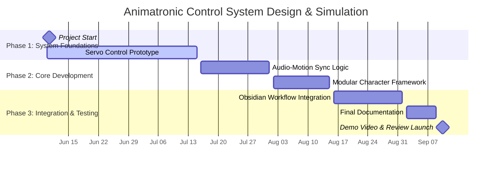

```mermaid
gantt
    title Animatronic Control System Design & Simulation
    dateFormat  YYYY-MM-DD
    axisFormat  %b %d

    section Phase 1: System Foundations
    Project Start                :milestone, start, 2025-06-10, 1d
    Servo Control Prototype      :active, task1, 2025-06-10, 2025-07-15

    section Phase 2: Core Development
    Audio-Motion Sync Logic      :task2, 2025-07-16, 2025-08-01
    Modular Character Framework  :task3, 2025-08-02, 2025-08-15

    section Phase 3: Integration & Testing
    Obsidian Workflow Integration:task4, 2025-08-16, 2025-09-01
    Final Documentation          :task5, 2025-09-02, 2025-09-09
    Demo Video & Review Launch   :milestone, demo, 2025-09-10, 1d
```
