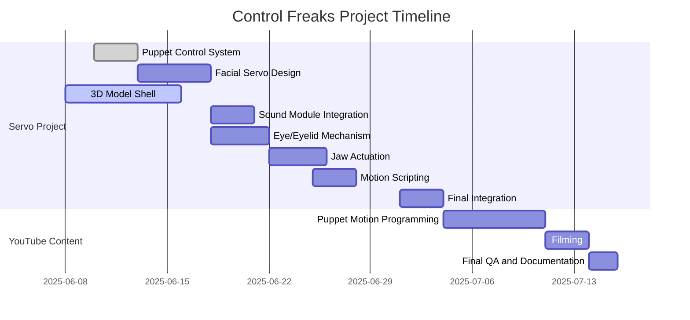

---

title: "Control Freaks Vault – Project Timeline"
date: "2025-06-10"
project: "Control Freaks Vault"
status: "in progress"
tags: \["timeline", "project-management", "servo-project", "youtube-production"]
--------------------------------------------------------------------------------

# Project Timeline for Control Freaks Vault

## Project Overview

The *Control Freaks Vault* is an umbrella project comprising two integrated yet distinct tracks:

1. **Servo-Controlled Puppet Project** (`CT##` Tasks): Focused on the technical and mechanical development of animatronic puppets.
2. **YouTube Production Project** (`T##` Tasks): Focused on storytelling, video production, and content creation using the puppets.

* **Project Start Date**: 2025-06-08
* **Projected End Date**: 2025-07-15

Both projects progress in parallel and share resources, dependencies, and coordination milestones.

---

## Milestones

### Servo-Controlled Puppet Project

| Milestone # | Description                           | Due Date   |
| ----------- | ------------------------------------- | ---------- |
| M1-CT       | Puppet Control System Defined         | 2025-06-10 |
| M2-CT       | Facial & Jaw Mechanisms Engineered    | 2025-06-17 |
| M3-CT       | Electronics Integration Complete      | 2025-06-20 |
| M4-CT       | Puppet Shell, Skin & Wiring Assembled | 2025-06-30 |
| M5-CT       | Final Integration and Functional Test | 2025-07-03 |

### YouTube Production Project

| Milestone # | Description                           | Due Date   |
| ----------- | ------------------------------------- | ---------- |
| M1-T        | Puppet Programming & Scene Animation  | 2025-07-10 |
| M2-T        | Demo Filming & Voice Editing Complete | 2025-07-13 |
| M3-T        | Final QA & Public Launch              | 2025-07-15 |

---

## Tasks and Activities

### Servo-Controlled Puppet Project Tasks (`CT##`)

| Task ID | Task Description                        | Start Date | End Date   | Duration (Days) | Assigned To       | Status      | % Complete |
| ------- | --------------------------------------- | ---------- | ---------- | --------------- | ----------------- | ----------- | ---------- |
| CT01    | Define Puppet Control System            | 2025-06-10 | 2025-06-12 | 3               | Engineering Team  | Not Started | 0%         |
| CT02    | Facial Motion Mechanism (Servo Design)  | 2025-06-13 | 2025-06-17 | 5               | Mechanical Team   | Not Started | 0%         |
| CT03    | 3D Model Puppet Shell (Head & Body)     | 2025-06-08 | 2025-06-15 | 8               | CAD Team          | In Progress | 60%        |
| CT04    | Integrate Sound Module & Sync Logic     | 2025-06-18 | 2025-06-20 | 3               | Electronics Team  | Not Started | 0%         |
| CT05    | Cable Routing and Mounting Architecture | 2025-06-21 | 2025-06-23 | 3               | Mechatronics Team | Not Started | 0%         |
| CT06    | Puppet Skin Material Test & Fabrication | 2025-06-15 | 2025-06-22 | 8               | FX Team           | Not Started | 0%         |
| CT07    | Eye and Eyelid Motion Assembly          | 2025-06-18 | 2025-06-21 | 4               | Robotics Lead     | Not Started | 0%         |
| CT08    | Jaw Actuation Mechanism                 | 2025-06-22 | 2025-06-25 | 4               | Robotics Lead     | Not Started | 0%         |
| CT09    | Hinge Calibration & Motion Scripting    | 2025-06-25 | 2025-06-27 | 3               | Software Lead     | Not Started | 0%         |
| CT10    | Internal Wiring Harness Build           | 2025-06-26 | 2025-06-30 | 5               | Assembly Team     | Not Started | 0%         |
| CT11    | Final System Integration                | 2025-07-01 | 2025-07-03 | 3               | Thomas Ware       | Not Started | 0%         |

### YouTube Production Project Tasks (`T##`)

| Task ID | Task Description                    | Start Date | End Date   | Duration (Days) | Assigned To     | Status      | % Complete |
| ------- | ----------------------------------- | ---------- | ---------- | --------------- | --------------- | ----------- | ---------- |
| T01     | Puppet Motion Programming & Testing | 2025-07-04 | 2025-07-10 | 7               | Automation Team | Not Started | 0%         |
| T02     | Video Demo Setup and Filming        | 2025-07-11 | 2025-07-13 | 3               | Creative Team   | Not Started | 0%         |
| T03     | Final QA Review and Documentation   | 2025-07-14 | 2025-07-15 | 2               | All Leads       | Not Started | 0%         |

---

## Critical Path

CT01 → CT02 → CT03 → CT04 → CT07 → CT08 → CT09 → CT11 → T01 → T02 → T03

---

## Review Points

* **Review 1**: Servo & Frame Validation – 2025-06-18
* **Review 2**: Puppet Motion QA – 2025-06-30
* **Review 3**: Video Edit Review – 2025-07-13

---

## Visual Representation

---

## Summary

This updated timeline provides visibility across both hardware development and creative production workflows, ensuring milestones align for synchronized delivery.

**Note**: Timeline reviewed weekly. File path: *Control Freaks Vault > Project\_Management > Timeline.md*
