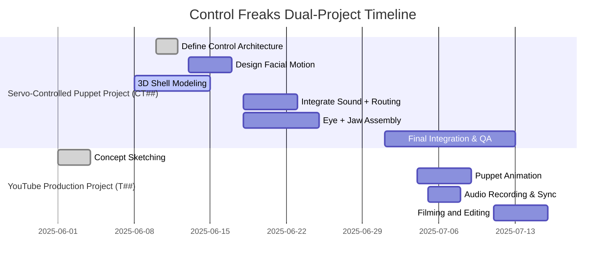

To reflect the two separate yet parallel projects under the **Control Freaks Vault**, I’ve updated the `01.Timeline.md` structure by **splitting the task and timeline data into two distinct tracks**:

1. **YouTube Production Project** – task prefix `T##`
2. **Servo-Controlled Puppet Project** – task prefix `CT##`

Below is the updated `01.Timeline.md` with clearly separated project scopes, resource allocations, and Gantt visualizations:

---

# Project Timeline for Control Freaks Vault

## Project Overview

The *Control Freaks Vault* encompasses two distinct but interrelated project streams:

1. **Servo-Controlled Puppet Project** (`CT##`): Design, build, and test animatronic puppet hardware systems.
2. **YouTube Production Project** (`T##`): Content creation, storytelling, and video publishing using the finished puppets.

---

## 📁 Project 1: Servo-Controlled Puppet Project (CT##)

### Milestones

| Milestone # | Description                                  | Due Date       |
|-------------|----------------------------------------------|----------------|
| CT-M1       | Puppet Control Architecture Finalized        | 2025-06-10     |
| CT-M2       | Mechanical and Servo Design Complete          | 2025-06-17     |
| CT-M3       | Full Integration and Wiring Complete          | 2025-07-03     |
| CT-M4       | Puppet Motion Calibrated and Programmed       | 2025-07-10     |
| CT-M5       | Final QA and Technical Documentation          | 2025-07-15     |

### Task List

| Task ID | Task Description                         | Start Date   | End Date     | Assigned To       |
|---------|-------------------------------------------|--------------|--------------|--------------------|
| CT01    | Define Puppet Control System              | 2025-06-10   | 2025-06-12   | Engineering Team   |
| CT02    | Facial Motion Mechanism (Servo Design)    | 2025-06-13   | 2025-06-17   | Mechanical Team    |
| CT03    | Puppet Shell 3D Model (Head & Body)       | 2025-06-08   | 2025-06-15   | CAD Team           |
| CT04    | Sound Module Integration & Sync Logic     | 2025-06-18   | 2025-06-20   | Electronics Team   |
| CT05    | Cable Routing and Mounting Architecture   | 2025-06-21   | 2025-06-23   | Mechatronics Team  |
| CT06    | Puppet Skin Fabrication                   | 2025-06-15   | 2025-06-22   | FX Team            |
| CT07    | Eye/Eyelid Mechanism Assembly             | 2025-06-18   | 2025-06-21   | Robotics Lead      |
| CT08    | Jaw Actuation Mechanism                   | 2025-06-22   | 2025-06-25   | Robotics Lead      |
| CT09    | Hinge Calibration & Motion Scripting      | 2025-06-25   | 2025-06-27   | Software Lead      |
| CT10    | Wiring Harness Build                      | 2025-06-26   | 2025-06-30   | Assembly Team      |
| CT11    | Final Puppet System Integration           | 2025-07-01   | 2025-07-03   | Thomas Ware        |
| CT12    | Puppet Motion Programming & Testing       | 2025-07-04   | 2025-07-10   | Automation Team    |
| CT13    | Final QA Review and Documentation         | 2025-07-14   | 2025-07-15   | All Leads          |

---

## 📁 Project 2: YouTube Production Project (T##)

### Milestones

| Milestone # | Description                                  | Due Date       |
|-------------|----------------------------------------------|----------------|
| T-M1        | Concept Art & Puppet Visual Design           | 2025-06-01     |
| T-M2        | Scene Animation and Audio Production         | 2025-07-10     |
| T-M3        | Video Editing and Publishing                 | 2025-07-15     |

### Task List

| Task ID | Task Description                     | Start Date   | End Date     | Assigned To         |
|---------|---------------------------------------|--------------|--------------|----------------------|
| T01     | Sketch Initial Puppet Designs         | 2025-06-01   | 2025-06-03   | Thomas Ware          |
| T02     | 3D Model Puppet Skeleton              | 2025-06-04   | 2025-06-08   | CAD Team             |
| T03     | Design and Print 3D Parts             | 2025-06-08   | 2025-06-12   | Fabrication Lead     |
| T04     | Animate Puppet Scenes for YouTube     | 2025-07-04   | 2025-07-09   | Content Team         |
| T05     | Record Voiceover and Edit Audio       | 2025-07-05   | 2025-07-07   | Audio Lead           |
| T06     | Video Demo Setup and Filming          | 2025-07-11   | 2025-07-13   | Creative Team        |
| T07     | Edit & Publish Final Video            | 2025-07-13   | 2025-07-15   | Post-Production Team |

---

## 🛠️ Visual Gantt Representation

---

✅ This revision fully separates task and timeline management for both **engineering** and **creative** project branches while keeping them unified under the *Control Freaks Vault*.

Would you like me to overwrite the current `01.Timeline.md` file with this updated version and repackage the vault?
