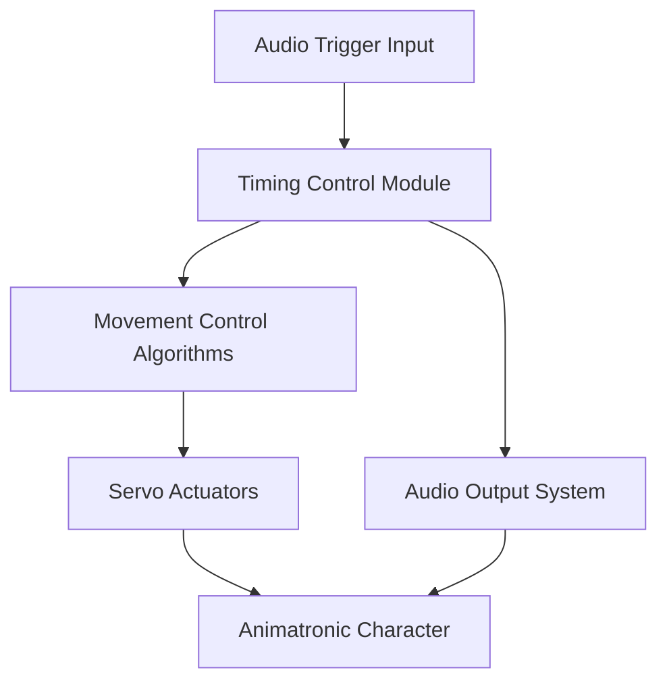

 **Project** outline focused on the **Control System** of an animatronic figure, integrating core concepts from control systems engineering with animatronics and entertainment control logic.

---

## 🎯 **ChatGPT Project: Animatronic Control System Design & Simulation**

### **1. Project Title**

**Design and Simulation of a Control System for an Animatronic Figure with Synchronized Audio-Visual Cues**

---

### **2. Objective**

To design a computer-based control system that manages the real-time operation of an animatronic character, including precise timing and synchronization of movements (motors/actuators) and audio (speech/music), using control systems engineering principles.

---

### **3. Scope**

This project focuses on:

- Modeling the dynamics of servo motors used for facial expressions and gestures.
    
- Designing a control strategy (PID, state-space, or digital logic-based).
    
- Ensuring time synchronization between audio output and motor actuation.
    
- Simulating and testing the system performance using software tools (e.g., MATLAB/Simulink or Python).
    

---

### **4. System Components**

|**Component**|**Description**|
|---|---|
|Servo Motors|Drive joints for head, arms, and mouth movements.|
|Audio System|Pre-recorded or real-time generated speech or music.|
|Microcontroller / PLC|Executes control logic (e.g., Arduino, Raspberry Pi, or industrial PLC).|
|Timing Controller|Ensures synchronization of motion with audio cues.|
|Sensors (optional)|Position or feedback sensors (encoders, limit switches) for closed-loop control.|

---

### **5. Control System Architecture**

---

### **6. Key Control Engineering Concepts Involved**

- **Closed-Loop Feedback**: To control actuator position precisely.
    
- **Synchronization Algorithms**: To coordinate audio with motion timing.
    
- **PID Control or State Feedback**: For actuator dynamics.
    
- **Digital Sampling and Delay Management**: To avoid desynchronization due to latency.
    

---

### **7. Design Steps**

1. **System Identification**:
    
    - Model actuator dynamics (e.g., transfer function or state-space).
        
2. **Controller Design**:
    
    - Implement a PID or state-space controller for each joint.
        
3. **Synchronization Logic**:
    
    - Time-stamped control scripts to align audio waveform events with motion triggers.
        
4. **Simulation**:
    
    - Use MATLAB/Simulink or Python (with `control`, `numpy`, `matplotlib`) for simulation.
        
5. **Implementation Prototype**:
    
    - Deploy on hardware (e.g., Arduino + servo drivers + SD card audio playback).
        
6. **Testing & Validation**:
    
    - Evaluate synchronization performance, settling time, and tracking error.
        

---

### **8. Tools & Technologies**

|**Tool**|**Purpose**|
|---|---|
|MATLAB/Simulink|System modeling, control design, and simulation|
|Python + `control` lib|Lightweight modeling and analysis|
|Arduino IDE / Raspberry Pi|Microcontroller development|
|Audacity|Audio editing and cue alignment|
|Fusion 360 / SolidWorks|Mechanical design of animatronic parts (optional for full prototype)|

---

### **9. Potential Challenges**

- Latency in audio playback vs. motor actuation.
    
- Real-time control on limited hardware (e.g., timing jitter on Arduino).
    
- Need for position feedback to ensure gestures are correctly timed.
    
- Managing concurrent motions without interference.
    

---

### **10. Extensions**

- Add **adaptive control** for variable loads (e.g., different facial expressions).
    
- Implement **gesture scripting language** (like animation keyframes).
    
- Use **computer vision feedback** for audience interaction.
    
- Expand to a **networked control system** for multiple animatronics.
    

---

### **11. Deliverables**

- System model and control design report
    
- Control logic source code (MATLAB or Arduino/C++)
    
- Simulation results (plots of position vs. time, audio sync points)
    
- Optional: Prototype video or real-time demo
    

---

Let me know if you'd like a deeper dive into any section (e.g., PID tuning, timing algorithms, simulation script).